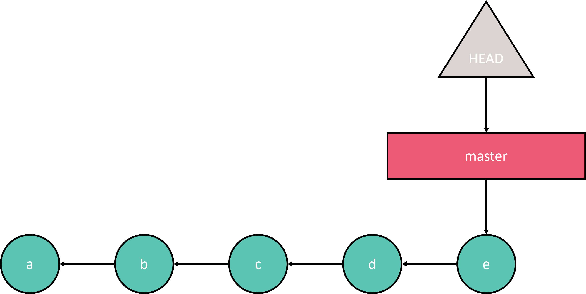
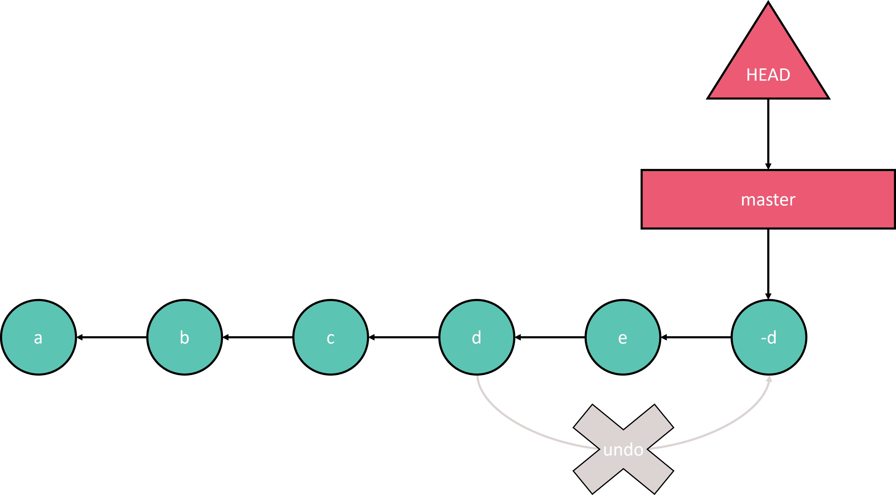
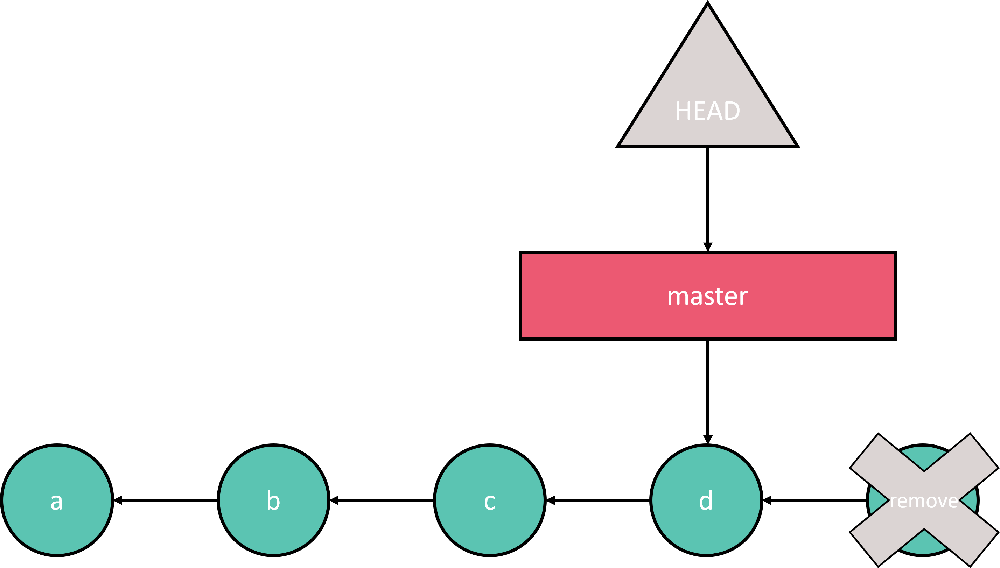

# Rewriting history (lite edition)

> _“Who controls the past controls the future. Who controls the present controls the past.”_
>
> - George Orwell, 1984

This section goes over some of the most common ways to undo things or making small tweaks to your commit history.

```{seealso}
More info on undoing things can be found in these excellent sections of the Pro Git book:

- [https://git-scm.com/book/en/v2/Git-Basics-Undoing-Things](https://git-scm.com/book/en/v2/Git-Basics-Undoing-Things)
- [https://git-scm.com/book/en/v2/Git-Tools-Rewriting-History](https://git-scm.com/book/en/v2/Git-Tools-Rewriting-History)
- [https://git-scm.com/book/en/v2/Git-Tools-Reset-Demystified](https://git-scm.com/book/en/v2/Git-Tools-Reset-Demystified)
```

```{warning}
If you feel confident, you can skip this section at your own peril! A code block is available [here]() to initialise a repository with all the required components for the following chapters.

The topics covered in this section are: `commit --amend`, `restore`, `reset`, `revert` and `checkout`.
```

## Altering the most recent commit

Uh oh! We forgot to update our readme and did not mention the amazing R script we made. We could simply create a new commit, but let's try something else instead: modifying the most recent commit.

`````{tab-set}

````{tab-item} Exercise 3

```{admonition} Instructions
:class: hint
- Inspect your history of commits before and after this exercise.
- Update the readme and ask git for a status update.
- Add the modified readme to the previous commit without making a new one (hint: in git lingo this called _amending_).
```

````

````{tab-item} Solution 3

You can use `git log` to show an overview of your previous commits.

```bash
$ git log
commit 410c0a70ca4415553bed5f636202d2efcf5e6405 (HEAD -> master)
Author: Pieter Moris <13552343+pmoris@users.noreply.github.com>
Date:   Wed Aug 17 12:30:36 2022 +0200

    Create a vector

    Adds an R script to create a nifty vector.

commit 02b6530617bd305f686df19fbbaac4689f5e5cf1
Author: Pieter Moris <13552343+pmoris@users.noreply.github.com>
Date:   Wed Aug 17 12:19:18 2022 +0200

    Initial commit
```

Next, alter the files as you see fit.

```bash
echo "\nThis amazing repository houses an R script that creates one vector to rule them all." >> readme.md
```

```bash
$ git status
On branch master
Changes not staged for commit:
  (use "git add <file>..." to update what will be committed)
  (use "git restore <file>..." to discard changes in working directory)
        modified:   readme.md

no changes added to commit (use "git add" and/or "git commit -a")
```

Git suggests us to use `git commit -a` (or `--all`, which would _add and commit_ all modified files to a new commit), but because we want to instead update the previous commit message -- essentially rewriting history -- we will first `add` the changes and then use `commit --amend` instead (confusingly also beginning with an _a_).

This will replace the tip of the current branch by creating a new commit and even allow us to change the commit message. That means you could also use this command to only change the commit message, without changing any of the files' contents.

```bash
git add readme.md
git commit --amend
```

```bash
  GNU nano 4.8                          /home/pmoris/git-collab/.git/COMMIT_EDITMSG
Create a vector

Adds an R script to create a nifty vector
and talks about it in the readme.

# Please enter the commit message for your changes. Lines starting
# with '#' will be ignored, and an empty message aborts the commit.
#
# Date:      Wed Aug 17 12:30:36 2022 +0200
#
# On branch master
# Changes to be committed:
#       modified:   readme.md
#       new file:   vectors_ftw.R
#
```

The log now indeed shows the same number of commits as before, but the most recent one has been replaced.

```bash
$ git log
commit b2c2e84a1c0deebd6199e790f0db133fc0e0853c (HEAD -> master)
Author: Pieter Moris <13552343+pmoris@users.noreply.github.com>
Date:   Wed Aug 17 12:30:36 2022 +0200

    Create a vector

    Adds an R script to create a nifty vector
    and talks about it in the readme.

commit 02b6530617bd305f686df19fbbaac4689f5e5cf1
Author: Pieter Moris <13552343+pmoris@users.noreply.github.com>
Date:   Wed Aug 17 12:19:18 2022 +0200

    Initial commit
```

````

`````

```{warning}
Be very careful when amending to a public branch that has already been pushed to a repository! This action will alter commits (essentially removing the most recent one and replacing it with a new version). If you forcefully push this new history to a remote repository, it could become a problem for collaborators that were already basing their work off the original state of the repository. More on that later when we look at other methods of changing the git commit history and how remote repositories work.


```

## Uncommitted whoopsies

What if you want to undo changes in your working directory or staging area, i.e. before you have committed them? How can files be returned to the way they were in a previous commit? This next exercise will teach you!

`````{tab-set}

````{tab-item} Exercise 4

```{admonition} Instructions
:class: hint
- Inspect the `git log` and `git status` before, during and after this exercise.
- Create a new text file and commit it.
- Add some additional changes to the file and stage it, but do not commit it just yet.
- Realise that you don't actually want to stage those additional changes just yet and unstage them.
- Revert the file back to its original state in your working directory too.
```

````

````{tab-item} Solution 4

First we create a new text file and commit it.

```bash
echo "There will be cake at the end." > cake.txt
git add cake.txt
git commit -m "Add cake declaration"
```

Then, we modify the file again and stage it.

```bash
echo "The cake is a lie." > cake.txt
git add cake.txt
```

When we check the status, git will actually tell us what we can do to unstage a file.

```bash
$ git status
On branch master
Changes to be committed:
  **(use "git restore --staged <file>..." to unstage)**
        modified:   cake.txt
```

```bash
git restore --staged cake.txt
```

After unstaging the file it will still be modified in our working directory. Fortunately, like before, git gives us a suggestion on how to proceed. To undo these changes for the now unstaged (= not primed for committing), but modified file (it really is changed in our working directory still), the `restore` command can be used again.

```bash
$ git status
On branch master
Changes not staged for commit:
  (use "git add <file>..." to update what will be committed)
  (use "git restore <file>..." to discard changes in working directory)
        modified:   cake.txt

no changes added to commit (use "git add" and/or "git commit -a")
```

```bash
git restore cake.txt
```

Afterwards, our working directory will be clean again. It will be in the same state as it was in the last commit, i.e. the one that the current branch and HEAD are pointing towards, i.e. the most recent one in the `git log`. You can check by using `git status` or by manually inspecting the contents of the files.

```bash
$ cat cake.txt
There will be cake at the end.
```

````

`````

```{note}
In the past, prior to git v2.23, unstaging files was handled by `git reset <filepath>` and removing changes to a file in the working directory by `git checkout -- <filepath>`. Those methods still work, but the `restore` command was introduced to simplify things, because `reset` and `checkout` also serve a bunch of other roles, e.g. when used on commits rather than files. More on this later when we talk about `reset` in the next section and about branches in the section after that, where we showcase the `switch` command (which takes over a few other roles of `checkout`).

For more reading right now, _check out_ (hehe): [https://stackoverflow.com/questions/58003030/what-is-the-git-restore-command-and-what-is-the-difference-between-git-restor](https://stackoverflow.com/questions/58003030/what-is-the-git-restore-command-and-what-is-the-difference-between-git-restor).
```

## Committed whoopsies

For bigger _whoopsies_, we'll need a different strategy. Let's suppose we want to completely undo an erroneous commit. There are a few different approaches we could take.

Suppose we start in the following state and we decide that the changes that were introduced in commit `e` should be undone.

:::{figure-md} fig-pre-reset-target
:align: center



A git history with a single branch where the latest (erroneous) commit `e` is checked out.
:::

`git revert <commit>` is the safest way to undo specific commits, because it does not actually alter your history. Instead, it creates a new commit that undoes a previous one, reverting every change that was introduced at that point. Consequently, it is safe to use when collaborating with others on a remote branch. Also note that any commit can be reverted at any time, not just the most recent one.

:::{figure-md} fig-revert-target
:align: center



Reverting commit `d` introduces an _inverted_ commit `d'`.
:::

`git reset [ --hard | --mixed | --soft ] <commit>` on the other hand, allows you to restore things back to a previous commit (i.e. remove more recent commits from the history). Like `--amend` and unlike `revert`, this alters the commit history and can thus be dangerous to use when collaborating with others (i.e. when your commits were already pushed to a remote repository).

:::{figure-md} fig-reset-target
:align: center



Resetting to a previous commit `d` by removing `e`.
:::

Depending on the additional flag you provide to the command, it will behave slightly differently:

- `--soft`: moves what `HEAD` is pointing to (i.e. usually the branch itself) and leaves your working directory and index/stage alone. In simpler terms, it changes your point of reference by telling git you are somewhere else in its history, but it does not alter any files yet.
- `--mixed` (default): same as `soft`, but additionally changes the contents of the index/stage to reflect the commit that HEAD now points to.
- `--hard`: same as `mixed`, but also makes the working directory resemble the index and thus the commit that was reset too. **This command can erase your work. Use it with caution!**

```{warning}
Never use `git reset` when commits have already been pushed to a public branch of your remote repository. By doing so, you would reset the public history, similar to what we explained in the `--amend` section. After pushing, you can no longer be sure that none of your collaborators are not already using and relying on those commits.

Any new commits that are created after resetting, would conflict with the public history on your remote repository (e.g. `origin/main` or `origin/branch`). If you would go ahead and push your altered history anyway (which would require you to `git push --force`), then others will no longer be able to `fetch` or `pull` from the branch they are working on.

Instead, you should reserve `reset` for just undoing local work, cleaning up or experimentation. If changes to commits on the remote are required, then `git revert` is the appropriate command instead.


```

The best way to learn this might be by deliberately breaking stuff, so let's get cracking!

`````{tab-set}

````{tab-item} Exercise

```{admonition} Instructions
:class: hint
- Create a bunch of new files and modify them one by one, until you have three new commits.
- Revert the first of the new commits.
<!-- - Make some additional changes in your working directory. -->
- Perform a `--soft` and `--mixed` `git reset` to the most recent commit and inspect the log before and after.
- Perform a `git reset --hard` reset to the most recent commit. Then realize your mistake and try to undo it!
```

````

````{tab-item} Solution

First we will create a few new files and commits.

```bash
touch my-guilty-pleasures.txt
git add my-guilty-pleasures.txt
git commit -m "Add guilty pleasures"
touch the-dress-is-blue.txt
git add *.txt
git commit -m "Describe dress colour"
mv the-dress-is-blue.txt the-dress-is-white.txt
git add -A
git commit -a -m "Update dress colour"
```

Next, we will revert a particular commit. First, find its commit id in the log:

```bash
$ git log
...

commit 2f3427d19bf2ef5347ed7fb2017fca423c1f9c08
Author: Pieter Moris <13552343+pmoris@users.noreply.github.com>
Date:   Tue Oct 4 16:04:22 2022 +0200

    Add guilty pleasures

commit 94af264c0ec9e4560d23c8bbacbb4370b9e20b65
Author: Pieter Moris <13552343+pmoris@users.noreply.github.com>
Date:   Wed Sep 7 15:48:49 2022 +0200

    Add cake declaration

...
```

Then revert it. Git is usually happy with just the five to seven first characters of those long IDs (SHA-1 checksums).

```bash
$ git revert 2f342
Removing my-guilty-pleasures.txt
[master a976b48] Revert "Add guilty pleasures"
 1 file changed, 0 insertions(+), 0 deletions(-)
 delete mode 100644 my-guilty-pleasures.txt```
```

It will be gone from your working directory now. But beware, the file is still present in one of the snapshots, it wasn't truly deleted. Which is a good thing most of the time, but just do not rely on this method to get rid of a password you accidentally committed ;)

Next, let's completely undo everything up to the original commit about cake (commit id `94af2` in my case). That is, we will reset (alter) the history, not just introduce reversed new commits to undo old ones.

```bash
git reset --soft 94af2
```

The soft reset moved my master branch (and `HEAD`) back to the cake commit, leaving both the index and working directory untouched. This is a cool trick you can use to "squash" multiple commits into one. If we were to add and commit all files at this point, we would have effectively replaced the two commits about dresses with just one new one.

```bash
$ ls
cake.txt  readme.md  the-dress-is-white.txt  vectors_ftw.R

$ git status
On branch master

Changes to be committed:
  (use "git restore --staged <file>..." to unstage)
        new file:   the-dress-is-white.txt
```

A mixed reset will also unstage the file from the index, but leave it in the working directory. Since `HEAD` was already moved, we no longer need to provide the commit ID (default value is `HEAD`.)

```bash
git reset --mixed
```

```bash
$ ls
cake.txt  readme.md  the-dress-is-white.txt  vectors_ftw.R

$ git status
On branch master

Untracked files:
  (use "git add <file>..." to include in what will be committed)
        the-dress-is-white.txt

nothing added to commit but untracked files present (use "git add" to track)
```

Finally, a hard reset will (usually) also clean our working directory, but not in this particular case because the file is still untracked.

```bash
$ git reset --hard
HEAD is now at 94af264 Add cake declaration

$ ls
cake.txt  readme.md  the-dress-is-white.txt  vectors_ftw.R
```

Committing it and then resetting does work. Note that I am using the syntax `HEAD^` to refer to the previous commit. More information on this revision syntax can be found at the end of this workshop.

```
$ git add the-dress-is-white.txt
$ git commit -m "Track dress file"
[master a40c9f9] Track dress file
 1 file changed, 0 insertions(+), 0 deletions(-)
 create mode 100644 the-dress-is-white.txt
$ git reset --hard HEAD^
HEAD is now at 94af264 Add cake declaration
$ ls
cake.txt  readme.md  vectors_ftw.R
```

`````

```{warning}
Always be _extremely careful_ when rewriting history, either via `git commit --amend`, `git rebase` or `git reset --hard`. As we will see later, rewriting history changes the commit ids, which are essentially hashes of file contents, messages and timestamps. If you already pushed your changes to a remote repository, especially when it is a shared repo that others might have pulled from in the meantime, and you alter your local history, the two git repos will become incompatible.

However, as long as you do not `push --force` your local changes to the remote, you should always be able to restore any mistakes. And there might even be cases when _forcefully pushing_ is the right thing to do, i.e. when it is a private branch only you are working on. You can check out [The Perils of Rebasing](https://git-scm.com/book/en/v2/Git-Branching-Rebasing#_rebase_peril) in the Pro Git book for more info.

**TL;DR: never `--amend` or `git reset --hard` a commit that was already pushed to (a shared branch of a) remote repository.**
```

---

We've now seen how to use `git reset` to undo commits, but as we mentioned in the section on `git restore`, it can also be used on files to unstage files from the index (or more accurately, to reset the indexed file to a particular commit or usually `HEAD`). Intuitively (?), "resetting" files to an older state based on a particular commit used to be handled by `git checkout` (see next section). That is why, since the introduction of the new `switch` command in git v2.23, it is more convenient to use the dedicated `restore` command (for both index and work directory changes) and to reserve `reset` for dealing with the commit-level.

In any case, when `reset` is applied to a filepath instead of a commit, it always operates in `--mixed` mode _and_ it does not move around what `HEAD` is pointing. Consequently, a command like `git reset file.txt` will effectively unstage files (by staging the file as it was in the commit that `HEAD` points to) and this is the help message that `git status` used to show before the introduction of `git restore --staged`. `git reset <commit> -- file.txt` would stage the file as it was in a particular commit.

```{seealso}
- [https://git-scm.com/book/en/v2/Git-Tools-Reset-Demystified](https://git-scm.com/book/en/v2/Git-Tools-Reset-Demystified)
- [https://www.atlassian.com/git/tutorials/undoing-changes/git-reset](https://www.atlassian.com/git/tutorials/undoing-changes/git-reset)
```

## Jumping around

`git checkout` is a rather confusing command on its own, because it can do so many different things. That is why two new commands were introduced, `git restore` and `git switch` (see next section on branches) to separate out some of its actions and make the similarities to `git reset` more clear.

- `git checkout <branch>` will behave similar to `git reset --hard`, by changing both the index and working directory, but unlike `reset` it actually moves `HEAD`, and not the underlying branch that it points to. It's therefor a safe and reversible operation that can be used to jump around. However, for simplicity, the dedicated `switch` command can now take over this role (see next section).
- `git checkout <commit>` is similar, but it will make `HEAD` point to a specific commit. This _detached head_ state can be dangerous, because it introduces dangling commits unreferenced by a branch. This can be used for quickly checking something out, but new commits shouldn't be created on top of this state. See [https://git-scm.com/docs/git-checkout#_detached_head](https://git-scm.com/docs/git-checkout#_detached_head).
- `git checkout (<commit>) -- file.txt` is the more dangerous version of `git reset (<commit>) file.txt`, in the sense that it resets both the index and the working directory, i.e. it is not workdir safe. As before, the `git restore` command should probably be preferred for simplicity.

:::{figure-md} fig-reset-checkout-target
:align: center


`git checkout` versus `git reset` when operating on branches.
Source: [https://git-scm.com/book/en/v2/Git-Tools-Reset-Demystified](https://git-scm.com/book/en/v2/Git-Tools-Reset-Demystified)
:::


`````{tab-set}

````{tab-item} Exercise

```{admonition} Instructions
:class: hint
- Checkout out an older commits by finding its id in the log.
- Notice how the index and work dir change.
- Check the git status message.
- Revert back to your previous branch (**not just the most recent commit id**).
```

````

````{tab-item} Solution
After checking out an older commit, git will show you a similar message to this:

```bash
$ git checkout b2c2e84
Note: switching to 'b2c2e84'.

You are in 'detached HEAD' state. You can look around, make experimental
changes and commit them, and you can discard any commits you make in this
state without impacting any branches by switching back to a branch.

If you want to create a new branch to retain commits you create, you may
do so (now or later) by using -c with the switch command. Example:

  git switch -c <new-branch-name>

Or undo this operation with:

  git switch -

Turn off this advice by setting config variable advice.detachedHead to false

HEAD is now at b2c2e84 Create a vector
```

We can revert back to the normal state via `git checkout master`.
````

`````

```{seealso}
- https://www.atlassian.com/git/tutorials/resetting-checking-out-and-reverting
- Long, but insightful read on the differences between `checkout`, `reset`, `switch` and `restore`: [https://stackoverflow.com/a/66309040](https://stackoverflow.com/a/66309040).
- A nice overview table of the safe and unsafe versions of `checkout` and `reset` can be found at the bottom of this page: [https://git-scm.com/book/en/v2/Git-Tools-Reset-Demystified](https://git-scm.com/book/en/v2/Git-Tools-Reset-Demystified).
```
